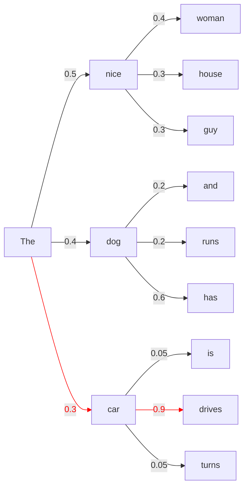
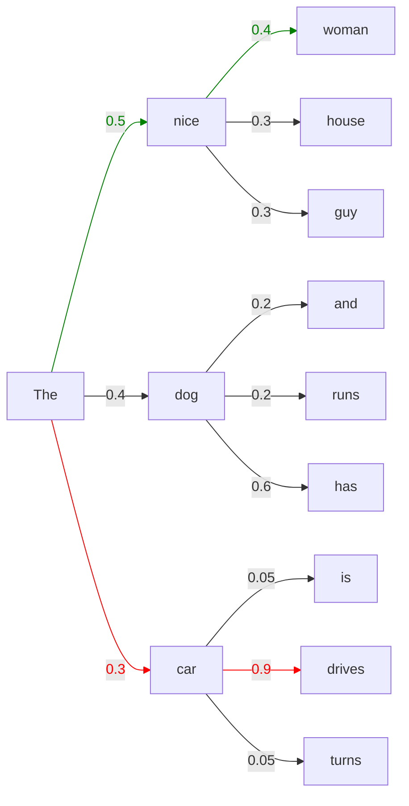
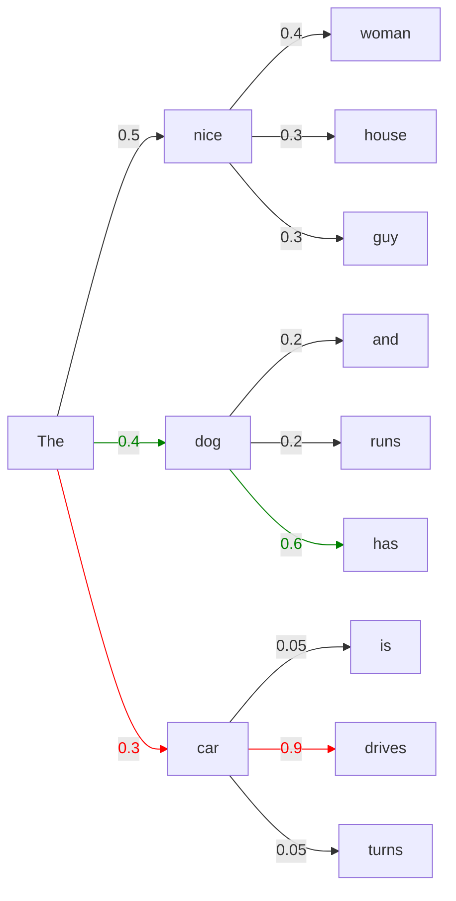

**语言模型解码算法**：指在语言模型生成过程中，从模型输出的概率分布 (logits) 中，根据一定策略选择并生成下一个词或符号的过程，直至构成完整的句子或文本。

<!--more-->

需要注意这里的解码不同于 Transformer 架构大语言模型的 Decoder 块。大语言模型的 Decoder 块是模型结构的一部分，而这里讲的解码算法不属于模型**结构**，只是利用模型来生成完整句子的一种**算法**。

# 1 理想情况

## 1.1 原理

语言模型的解码目标便是寻求最大化以下联合概率：
$$
P(y_1, y_2, ..., y_T | x) = \prod_{t=1}^T P(y_t | y_1, ..., y_{t-1}, x)
$$
但需要注意的是，大语言模型是一个自回归模型，下一个 Token 的概率分布是受当前 Token 影响的，这个性质使得取得上述概率的全局最优解较为困难。

例如以下概率分布的例子，红线是全局最优解：

## 1.2 复杂度

如果我们要求得理想情况下的最优解，那么我们需要遍历所有情况来求取。假设每次生成的概率分布都有 $n$ 种 Token，生成长度为 $m$，那么需要进行的 LLM 推理次数为：
$$
N=\sum_{i=0}^{m-2}n^i=\frac{n^{m-1}-1}{n-1}
$$
它的复杂度为 $O(n^m)$，明显是不可接受的。当下大语言模型的序列长度到 8192 已经是基本操作，显然不可能使用这种方式来进行解码。

# 2 贪心解码（Greedy Decoding）

## 2.1 原理

贪心解码利用了贪心思想，每次挑选下一个 Token 时，只挑概率最大的 Token。公式表述即为：
$$
w_t = \underset{w}{\arg\max}\;P(w|w_{1:t-1})
$$
对于上面的示例，使用贪心解码就会选择绿色的路线（红色为全局最优解）：

## 2.2 复杂度

对于贪心解码，假设每次生成的概率分布都有 $n$ 种 Token，生成长度为 $m$，那么需要进行的 LLM 推理次数为：
$$
N=m-1
$$
可以发现贪心解码的复杂度是线性的，效率非常高。

# 3 束搜索（Beam Search）

## 3.1 原理

贪心解码只挑概率最大的 Token，而束搜索引入了参数 `num_beams`，每次挑选 `num_beams` 个大值进行尝试。可以发现，当 `num_beams=1` 时，束搜索便退化为贪心搜索。

对于上面的示例，使用 `num_beams=2` 的束搜索就会选择绿色的路线（红色为全局最优解）：

## 3.2 复杂度

对于束搜索，假设每次生成的概率分布都有 $n$ 种 Token，生成长度为 $m$，参数 `num_beams` 记为 $b$，那么需要进行的 LLM 推理次数为：
$$
N=b(m-1)
$$
可以发现束搜索的复杂度也是线性的，效率也非常高，性价比比较高。

# 4 **随机采样**（Sampling）

## 4.1 原理

随机采样按照概率分布随机选择下一个词，虽然也不能保证采样到全局最优解，但是这样生成的句子可能更具多样性，有可能形成更好的结果。

随机采样也有很多种方式：

- Temperature 采样
- Top-k 采样
- Top-p 采样

## 4.2 Temperature 采样

Temperature 采样的公式可以用 softmax 函数表示。假设模型输出一个向量 $z$，其中 $z_i$ 是第 $i$ 个 Token 的 logit。那么，经过 temperature 抽样后，第 $i$ 个 Token 被选中的概率 $p_i$ 可以用下面的公式计算：

$$
p_i = \frac{e^{z_i / T}}{\sum_j e^{z_j / T}}
$$

其中，$T$ 是 temperature 参数，$sum_j$ 是对所有可能的 Token 求和。这个公式说明：

- 当 $T$ 越小，高概率的 Token 会变得更有可能被抽到，低概率的 Token 会变得更不可能被抽到，模型更加固定。
- 当 $T$ 越大，高概率和低概率的 Token 之间的差距会变得更小，模型生成的文本会更加随机和多样。

## 4.3 Top-k 采样

Top-k 采样先找出 $k$ 个最有可能的 Token，然后在这 $k$ 个 Token 中计算概率分布，然后进行抽取：

1. LLM 提供下一个 Token 的概率 logits。
2. 然后，模型会选择概率最高的 $k$ 个词。
3. 最后，模型会从这 $k$ 个词中随机抽取一个。

## 4.4 Top-p 采样

Top-p 才行先找出累计概率超过 $p$ 的最小候选单词集，然后在这个集合中进行抽取：

1. LLM 提供下一个 Token 的概率 logits。
2. 然后，模型会从概率高到低的 Token 开始选择，直到累计概率超过 $p$。
3. 最后，模型会从这些词中随机抽取一个。

Top-p 采样实际上是对 Top-k 采样的针对优化，因为 Top-k 采样固定了 $k$ 的值，这便可能导致选出的 $k$ 个 Token 中囊括了概率非常小的 Token，选择这些 Token 是不合理的。而 Top-p 使用累计概率，便相当于实现了 $k$ 的动态调整，如果概率分布由几个高概率和一堆小概率组成，Top-p 就会避免将小概率囊括到待选 Token 中。

## 4.5 复杂度

对于随机采样，假设每次生成的概率分布都有 $n$ 种 Token，生成长度为 $m$，那么需要进行的 LLM 推理次数为：
$$
N=m-1
$$
复杂度和贪心解码是一样的，但是会较贪心解码有更好的多样性，属于综合效果较好的解码方式。

# 5 transformers 库

transformers 库将以上解码方法合并到了 generate 方法中，通过特定的参数组合来决定使用哪种解码方式：

- 贪心解码：`num_beams=1` 且 `do_sample=False`
- 随机采样：`num_beams=1` 且 `do_sample=True`
- 束搜索：`num_beams>1` 且 `do_sample=False`
- 随机束搜索：`num_beams>1` 且 `do_sample=True`，相当于使用随机采样代替选择 Top-k

源代码：https://github.com/huggingface/transformers/blob/v4.20.1/src/transformers/generation_utils.py

最新版的 transformers 库对 generate 方法有调整，不过没有特别大的变化。
