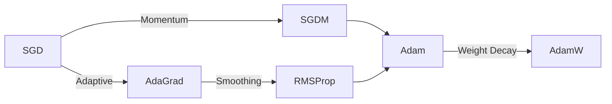

**优化器 (Optimizer)**：机器学习中通过梯度信息调整模型参数以最小化损失的算法。

<!--more-->

# 0 关系



> 由于网上优化器相关的图片来源混乱，许可证情况未知，因此本笔记就不引用网上他人的图片了。很推荐去翻翻其他文章的图片，有个小球在损失平面上滚动下降的动图能够直观地对比不同方法的特性。

# 1 SGD (Stochastic Gradient Descent)

大家第一次学反向传播应该就是用的 SGD，它是最朴素的优化方式，求出梯度值后直接向梯度反方向步进一步。

SGD 的流程如下：

- **输入：**初始参数 $\theta_0$，训练总步数 $T$，学习率 $\eta$
- **输出：**最终参数 $\theta_T$
- 当前步数 $t\leftarrow0$
- 循环 $T$ 步训练
  - 计算 $\theta_t$ 上的梯度 $g_t=\nabla\mathcal{L}(\theta_t)$
  - 更新参数 $\theta_{t+1}\leftarrow\theta_t-\eta g_t$

整体公式如下：
$$
\theta_{t+1}=\theta_t-\eta\nabla\mathcal{L}(\theta_t)
$$
PyTorch 调用：

```py
optimizer = torch.optim.SGD(model.parameters(), lr=0.1)
```

# 2 SGDM (SGD with Momentum)

朴素的 SGD 存在一个问题，如果某一步正好 $\nabla\mathcal{L}(\theta_t)=0$，那么 SGD 就会直接卡在这个局部最优点，再也走不出来了。

为了解决这个问题，提出动量 (Momentum) 思想，在每一个优化步，结合当前梯度方向和历史梯度的方向进行步进，就仿佛物体的“惯性”一样。

SGDM 的流程如下：

- **输入：**初始参数 $\theta_0$，训练总步数 $T$，学习率 $\eta$，衰减因子 $\lambda$
- **输出：**最终参数 $\theta_T$
- 当前步数 $t\leftarrow0$
- 初始位移 $v_0\leftarrow0$
- 循环 $T$ 步训练
  - 计算 $\theta_t$ 上的梯度 $g_t=\nabla\mathcal{L}(\theta_t)$
  - 更新位移 $v_{t+1}\leftarrow\lambda v_t-\eta g_t$
  - 更新参数 $\theta_{t+1}\leftarrow\theta_t+v_{t+1}$

整体公式如下：
$$
\theta_{t+1}=\theta_t-\eta\sum_{i=0}^{t}\lambda^{t-i}\nabla\mathcal{L}(\theta_i)
$$
其中，衰减因子 $\lambda$ 可选取 $0.9$.

PyTorch 调用：

```py
optimizer = torch.optim.SGD(model.parameters(), lr=0.1, momentum=0.9)
```

# 3 AdaGrad (Adaptive Gradient Algorithm)

朴素的 SGD 存在一个问题，如果某个方向的损失平面非常“陡峭”，SGD 的梯度值便会很大，优化时很有可能会不断冲过最优值，持续震荡。

为了解决这个问题，提出了动态梯度的思想，在梯度“陡峭”的方向减小步进大小，在梯度“平缓”方向增大步进大小，就仿佛下陡峭山坡时迈更小步子一样。

AdaGrad 的流程如下：

- **输入：**初始参数 $\theta_0$，训练总步数 $T$，学习率 $\eta$，极小值 $\epsilon$
- **输出：**最终参数 $\theta_T$
- 当前步数 $t\leftarrow0$
- 初始状态 $s_0\leftarrow0$
- 循环 $T$ 步训练
  - 计算 $\theta_t$ 上的梯度 $g_t=\nabla\mathcal{L}(\theta_t)$
  - 更新状态 $s_{t+1}\leftarrow s_t+g_t^2$
  - 更新参数 $\displaystyle\theta_{t+1}\leftarrow\theta_t-\frac{\eta}{\sqrt{s_{t+1}}+\epsilon}g_t$

整体公式如下：
$$
\displaystyle\theta_{t+1}\leftarrow\theta_t-\frac{\eta}{\sqrt{\sum_{i=0}^{t}\nabla\mathcal{L}(\theta_i)^2}+\epsilon}\nabla\mathcal{L}(\theta_t)
$$
其中，$\epsilon$ 防止分母为 $0$ 影响训练。

PyTorch 调用：

```py
optimizer = torch.optim.Adagrad(model.parameters(), lr=0.01, eps=1e-10)
```

# 4 RMSProp

AdaGrad 存在一个问题，由于分母根号内的值是不断累加的，会导致学习率不断下降，优化速度缓慢。

为了解决这个问题，RMSProp 提出了平滑的思想，使用指数加权平均来处理分母根号内的值，避免不断累加。

RMSProp 的流程如下（与 AdaGrad 的差异已加粗）：

- **输入：**初始参数 $\theta_0$，训练总步数 $T$，学习率 $\eta$，极小值 $\epsilon$，平滑因子 $\alpha$
- **输出：**最终参数 $\theta_T$
- 当前步数 $t\leftarrow0$
- 初始状态 $s_0\leftarrow0$
- 循环 $T$ 步训练
  - 计算 $\theta_t$ 上的梯度 $g_t=\nabla\mathcal{L}(\theta_t)$
  - **更新状态 $s_{t+1}\leftarrow \alpha s_t+(1-\alpha)g_t^2$**
  - 更新参数 $\displaystyle\theta_{t+1}\leftarrow\theta_t-\frac{\eta}{\sqrt{s_{t+1}}+\epsilon}g_t$

其中，$\epsilon$ 防止分母为 $0$ 影响训练。

PyTorch 调用：

```py
optimizer = torch.optim.RMSprop(model.parameters(), lr=0.01, alpha=0.99, eps=1e-8)
```

# 5 Adam (Adaptive Moment Estimation)

Adam 将上述的 SGDM 和 RMSProp 做了结合。

Adam 的流程如下：

- **输入：**初始参数 $\theta_0$，训练总步数 $T$，学习率 $\eta$，极小值 $\epsilon$，衰减因子 $\beta_1$，平滑因子 $\beta_2$
- **输出：**最终参数 $\theta_T$
- 当前步数 $t\leftarrow0$
- 一阶动量 $m_0\leftarrow0$
- 二阶动量 $v_0\leftarrow0$
- 循环 $T$ 步训练
  - 计算 $\theta_t$ 上的梯度 $g_t=\nabla\mathcal{L}(\theta_t)$
  - 更新一阶动量 $m_{t+1}\leftarrow \beta_1 m_t+(1-\beta_1)g_t$
  - 更新二阶动量 $v_{t+1}\leftarrow \beta_2 v_t+(1-\beta_2)g_t^2$
  - 去偏 $\displaystyle\hat{m}_{t+1}\leftarrow \frac{m_{t+1}}{1-\beta_1^t},\hat{v}_{t+1}\leftarrow \frac{v_{t+1}}{1-\beta_2^t}$
  - 更新参数 $\displaystyle\theta_{t+1}\leftarrow\theta_t-\frac{\eta}{\sqrt{\hat{v}_{t+1}}+\epsilon}\hat{m}_{t+1}$

其中，衰减因子 $\beta_1$ 可选取 $0.9$，平滑因子 $\beta_2$ 可选取 $0.999$.

PyTorch 调用：

```py
optimizer = torch.optim.Adam(model.parameters(), lr=0.01, betas=(0.9, 0.999), eps=1e-8)
```

# 6 AdamW (Adam with Decoupled Weight Decay)

AdamW 向 Adam 中引入了权重衰减机制，该机制可以理解为一种 L2 正则化，对防止模型的过拟合起到作用。权重衰减可以理解为一种滑动平均。

AdamW 的流程如下（与 Adam 的差异已加粗）：

- **输入：**初始参数 $\theta_0$，训练总步数 $T$，学习率 $\eta$，极小值 $\epsilon$，衰减因子 $\beta_1$，平滑因子 $\beta_2$，权重衰减因子 $\lambda$
- **输出：**最终参数 $\theta_T$
- 当前步数 $t\leftarrow0$
- 一阶动量 $m_0\leftarrow0$
- 二阶动量 $v_0\leftarrow0$
- 循环 $T$ 步训练
  - 计算 $\theta_t$ 上的梯度 $g_t=\nabla\mathcal{L}(\theta_t)$
  - **权重衰减 $\theta_{t}\leftarrow\theta_t-\eta\lambda\theta_t$**
  - 更新一阶动量 $m_{t+1}\leftarrow \beta_1 m_t+(1-\beta_1)g_t$
  - 更新二阶动量 $v_{t+1}\leftarrow \beta_2 v_t+(1-\beta_2)g_t^2$
  - 去偏 $\displaystyle\hat{m}_{t+1}\leftarrow \frac{m_{t+1}}{1-\beta_1^t},\hat{v}_{t+1}\leftarrow \frac{v_{t+1}}{1-\beta_2^t}$
  - 更新参数 $\displaystyle\theta_{t+1}\leftarrow\theta_t-\frac{\eta}{\sqrt{\hat{v}_{t+1}}+\epsilon}\hat{m}_{t+1}$

其中，衰减因子 $\beta_1$ 可选取 $0.9$，平滑因子 $\beta_2$ 可选取 $0.999$，权重衰减因子 $\lambda$ 可选取 $0.01$.

PyTorch 调用：

```py
optimizer = torch.optim.AdamW(model.parameters(), lr=0.001, betas=(0.9, 0.999), weight_decay=0.01, eps=1e-8)
```